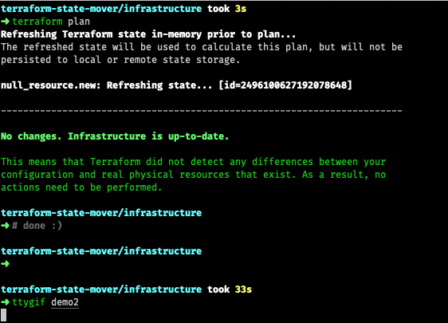

[](https://goreportcard.com/report/github.com/mbode/terraform-state-mover)
[](https://github.com/mbode/terraform-state-mover/actions)
[](https://github.com/mbode/terraform-state-mover/blob/master/LICENSE)

# Terraform State Mover

Helps refactoring terraform code by offering an interactive prompt for the [`terraform state mv`](https://www.terraform.io/docs/commands/state/mv.html) command.

## Installation

```bash
go get github.com/mbode/terraform-state-mover
```

## Usage

```bash
terraform-state-mover # inside a Terraform root directory
```

Extra arguments after a `--` are passed to the `terraform plan` call. This makes the following possible:
```bash
terraform-state-mover -- -var key=value  # setting variables
terraform-state-mover -- -var-file=variables.tfvars  # using variable files
```

## Demo



## Terraform version compatibility

| < 0.10.1 | 0.10.1…8 | 0.11.0…14 | 0.12.0…29 | 0.13.0…2 |
|:--------:|:--------:|:---------:|:--------:|:--------:|
| ✗        | ✓        | ✓         | ✓        | ✓        |

## Contributing
Pull requests are welcome. Please make sure to update tests as appropriate.

## License
[MIT](https://choosealicense.com/licenses/mit/)
